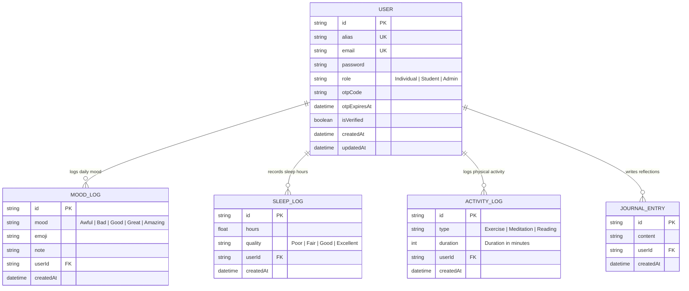

# Jucoch Capstone System - Entity-Relationship Diagram (ERD)

## 📌 Overview
The **Jucoch Wellness System** database is designed with 5 core entities supporting role-based access control (**Individual**, **Student**, **Admin**), anonymous alias protection, and daily wellness tracking logs.

---

## 📐 Visual Entity-Relationship Diagram (Mermaid)

---

## 🗂️ Data Dictionary & Entity Details

### 1. `USER`
Stores all account information across system roles:
- `id` (String, PK): Primary Key UUID.
- `alias` (String, Unique): Anonymous nickname (e.g. `BraveHeart24`, `PeacefulRiver`) for identity protection.
- `email` (String, Unique): Email used for authentication & recovery.
- `password` (String): Hashed password via `bcrypt`.
- `role` (String): Role discriminator (`Individual`, `Student`, `Admin`).
- `isVerified` (Boolean): OTP verification status.

### 2. `MOOD_LOG`
Stores daily user mood check-ins:
- `id` (String, PK): Primary Key UUID.
- `mood` (String): Mood scale (`Awful`, `Bad`, `Good`, `Great`, `Amazing`).
- `emoji` (String): Corresponding emoji icon (`😫`, `☹️`, `🙂`, `😊`, `🤩`).
- `userId` (String, FK): Foreign Key linking to `USER`.

### 3. `SLEEP_LOG`
Stores daily sleep duration and quality:
- `id` (String, PK): Primary Key UUID.
- `hours` (Float): Total hours slept (e.g. `7.5`).
- `quality` (String): Sleep quality rating.
- `userId` (String, FK): Foreign Key linking to `USER`.

### 4. `ACTIVITY_LOG`
Stores physical and wellness activities:
- `id` (String, PK): Primary Key UUID.
- `type` (String): Activity type (e.g. `Running`, `Meditation`).
- `duration` (Int): Time spent in minutes.
- `userId` (String, FK): Foreign Key linking to `USER`.

### 5. `JOURNAL_ENTRY`
Stores encrypted personal reflections:
- `id` (String, PK): Primary Key UUID.
- `content` (String): Reflection text.
- `userId` (String, FK): Foreign Key linking to `USER`.

---

## 🔑 Key Cardinality Relationships
- **1 User -> Many MoodLogs** (1:N)
- **1 User -> Many SleepLogs** (1:N)
- **1 User -> Many ActivityLogs** (1:N)
- **1 User -> Many JournalEntries** (1:N)
