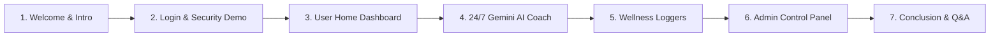

# 🎤 JUCOCH CAPSTONE — FRONTEND DEVELOPER DEMO & PRESENTATION SCRIPT

> **Role**: Frontend Lead / Developer  
> **System Name**: JUCOCH (Anonymized Mental Health Tracking & AI Coaching System)  
> **Tech Stack**: Expo React Native, TypeScript, React Native Paper, Lucide Icons, Expo Linear Gradient  

---

## 📋 DEMO FLOW SUMMARY & OVERVIEW

---

## 🎬 SCRIPT & STEP-BY-STEP DEMO WALKTHROUGH

### 📍 STEP 1: OPENING & GREETING (30 Seconds)

**What to do on screen**: Show the App Logo / Login Screen (`app/login.tsx`).

**What to say**:
> "Good morning / afternoon to our respected panelists, adviser, and guests. I am **[Your Name]**, acting as the **Frontend Lead Developer** for our Capstone Project, **JUCOCH**.
>
> As the Frontend Developer, my main objective was to craft a **premium, responsive, and empathetic user interface** using Expo React Native and TypeScript. We focused on zero-friction navigation, smooth 60 FPS animations, anonymous alias protection, and strict security controls."

---

### 📍 STEP 2: LOGIN & SECURITY DEMO (1.5 Minutes)

**What to do on screen**: 
1. Point to the **Role Selector Chips** (*Individual, Student, Admin*).
2. Show the **Password Eye Icon Toggle** (`👁️ / 👁️‍🗨️`).
3. Try typing spaces only (`"   "`) and click **Sign In** to trigger the strict validation error.

**What to say**:
> "Here on our **Sign In Screen**, you can immediately see our clean design system tailored with custom green gradients and React Native Paper components.
>
> 1. **Role Access Control**: Users can select their account role—*Individual, Student, or Admin*.
> 2. **Password Visibility Toggle**: We implemented an interactive Eye Icon feature so users can safely verify their password before submitting.
> 3. **Strict Validation**: Notice that if a user tries to enter blank spaces or empty credentials, our system strictly blocks the attempt with a clear error message.
> 4. **Role Security**: Regular users cannot sign in as Admin. Admin access is strictly restricted to designated creator accounts."

---

### 📍 STEP 3: USER HOME DASHBOARD (2 Minutes)

**What to do on screen**: 
1. Log in as a **Student** or **Individual** user.
2. Showcase the **AI Wellness Index Hero Card** and **Day Streak Counter**.
3. Perform a **1-Tap Quick Mood Check-in** (tap 'Great 😊').
4. Open the **Guided Breathing Exercise Modal** and click **Start Breath**.

**What to say**:
> "Once authenticated, the user is greeted by our **Personal Wellness Dashboard**.
>
> 1. **AI Wellness Index**: Up top, we have our high-impact Hero Gradient Card displaying the user's computed Wellness Index (e.g., 85/100) and live Day Streak counter.
> 2. **Quick Mood Check-in**: Users can record their current emotional state with a single tap. Watch as I tap 'Great 😊'—it immediately logs the mood and provides instant visual feedback.
> 3. **Guided Breathwork Modal**: For instant stress relief, we built an interactive 2-minute Guided Breathing exercise complete with an animated breathing ring and vagus nerve relaxation instructions."

---

### 📍 STEP 4: 24/7 GOOGLE GEMINI AI COACH & GUARDRAIL DEMO (2.5 Minutes)

**What to do on screen**: 
1. Navigate to the **Chat Tab** (`app/(tabs)/chat.tsx`).
2. Type a mental health question: *"I feel stressed about my exams, what should I do?"* -> Send.
3. Show the Gemini AI response.
4. Type an off-topic question: *"Can you write me a Python code for a calculator?"* -> Send.
5. Show the **Strict Guardrail Shield Refusal Response**.

**What to say**:
> "Now, let us navigate to one of our core features—the **24/7 AI Coach Chat**.
>
> This chatbot is powered by **Google Gemini AI** connected to our Node.js backend.
>
> First, let's ask a mental health question: *'I feel stressed about my exams.'* Notice how Gemini AI responds with warm, empathetic advice and practical coping steps.
>
> Now, to demonstrate our **Strict Scope & Safety Guardrails**: Because our capstone is exclusively dedicated to mental health, watch what happens if I ask an off-topic question like *'Write me a Python code for a calculator.'*
>
> As you can see, our **Guardrail Shield** politely declines off-topic queries and redirects the user back to emotional wellness support. This ensures our application stays 100% focused on its capstone mission."

---

### 📍 STEP 5: LOGGERS, ANALYTICS & DARK MODE (1.5 Minutes)

**What to do on screen**: 
1. Show the **Sleep Logger** and **Journal Logger**.
2. Navigate to the **Profile Tab** (`app/(tabs)/profile.tsx`).
3. Toggle the **Dark Theme / Light Theme Switch**.

**What to say**:
> "In addition to AI Chat, users can access dedicated loggers for **Sleep Hours & Quality**, **Physical Activities**, and **Journal Reflections**.
>
> Over on the **Profile Tab**, users can manage their anonymous alias and system preferences. We also implemented a full **Dark Mode / Light Mode toggle** to reduce eye strain during nighttime reflection."

---

### 📍 STEP 6: MASTER ADMIN CONTROL PANEL (1.5 Minutes)

**What to do on screen**: 
1. Sign out and log in as Admin using `conybeared69@gmail.com`.
2. Show the **Admin Master Control Panel** (`AdminDashboard.tsx`).
3. Point out the **Total Users counter**, **User Roster**, and **Live Daily Activity Feed**.

**What to say**:
> "Finally, let us sign in as a **Master System Admin**.
>
> In the Admin Control Panel, designated administrators have access to:
> 1. **Live User Roster**: Real-time management of registered accounts synced directly from our Neon PostgreSQL Cloud Database.
> 2. **Daily Activity Audit Feed**: Real-time monitoring of system check-ins, allowing admins to track application engagement while preserving individual privacy.
> 3. **Role Filters**: Convenient filtering between Individual and Student accounts."

---

### 📍 STEP 7: CONCLUSION & Q&A READINESS (30 Seconds)

**What to do on screen**: Return to the Home Dashboard or System Overview.

**What to say**:
> "To conclude, our frontend architecture provides an intuitive, highly responsive, and secure platform designed to make mental health support accessible 24/7.
>
> Thank you very much for your time and attention! We are now open for your questions, feedback, and recommendations."

---

## 💡 PRO TIPS FOR THE FRONTEND PRESENTER:
1. **Speak clearly and at a moderate pace**.
2. **Keep the phone or browser screen visible** to the panelists at all times.
3. **If asked about responsiveness**: Explain that Expo React Native automatically scales UI layouts across Android, iOS, and Web browsers seamlessly.
